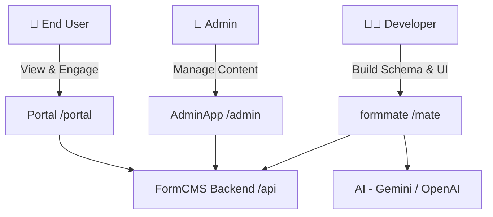

# FormCMS: The AI-Powered CMS

FormCMS is a cutting-edge, open-source Content Management System designed to revolutionize web development through AI. By automating the most tedious parts of development—schema design, data seeding, API creation, and UI building—FormCMS allows you to build complex, production-ready applications in minutes rather than weeks.

---

## ✨ Why FormCMS?

<table>
<tr>
<td align="center" width="33%">
<h3>🤖 AI-Powered</h3>
<p>Generate schemas, data, GraphQL queries, and full UI pages using natural language prompts. Let AI handle the tedious work while you focus on creativity.</p>
</td>
<td align="center" width="33%">
<h3>💬 Built-in Engagement</h3>
<p>Add engagement bars (views, likes, bookmarks, shares) and user avatars to any page with AI prompts. Social features are first-class citizens, not afterthoughts.</p>
</td>
<td align="center" width="33%">
<h3>🚀 Scalable & Performant</h3>
<p>P95 latency under 200ms, 2,400+ QPS throughput. Handle millions of posts with CDN caching and billions of user activities with horizontal sharding.</p>
</td>
</tr>
</table>

---

## ⚡ What You Can Do with AI

FormCMS isn't just a place to store content; it's an AI-driven development partner. 

### 1. Generate Entity (Schema)
Describe your business domain and AI will design normalized database schemas with relationships and appropriate data types.

### 2. Generate Data (Seeding)
Use AI to generate realistic, high-quality sample data that preserves relational integrity.

### 3. Generate Query (API)
Prompt the AI: "Give me all books published after 2020 by authors with more than 5 stars." It generates the GraphQL query and converts it into a REST endpoint automatically.

### 4. Generate Page (UI)
Go from prompt to page: "Build a landing page for my library that sections books by genre." AI generates the HTML/CSS and bridges it with your data queries.

### 5. Add Engagement Bar
Prompt: "Add likes, bookmarks, shares, and view count to my article page." AI integrates interactive social engagement features automatically.

### 6. Add User Avatar
Prompt: "Show the author's avatar and profile link." AI adds user identity components to your pages.

### 7. View History in Portal
Access all your generated schemas, queries, and pages in the portal. Compare versions and rollback changes anytime.

---

## 🎥 In Action

Watch FormCMS build a complete Library system (Entities, Data, Queries, and UI) from scratch in under 60 seconds (sped up 10x).


---

## 🟢 Live Demo

Try the live demo at [formcms.com/mate](https://formcms.com/mate).

**Credentials:**
- **Username:** `sadmin@cms.com`
- **Password:** `Admin1!`

---

## 🚀 Quick Start

Get the project running locally in 4 steps.

### 1. Clone Repositories
```bash
git clone git@github.com:formcms/formcms.git
git clone git@github.com:formcms/formmate.git
```

### 2. Start Backend (FormCMS)
```bash
cd formcms/examples/SqliteDemo
dotnet run
```
_Verify that `http://127.0.0.1:5000` is accessible._

### 3. Configure Environment (FormMate)
```bash
cd formmate/packages/backend
cp .env.example .env
```
Edit `.env` and add your Gemini API key (get a free one [here](https://aistudio.google.com/app/apikey)):
```ini
GEMINI_API_KEY=your_key_here
```

### 4. Start Development Server
```bash
# From formmate root
npm install
npm run dev
```
Visit **http://127.0.0.1:5173** to start building!

> **Note:** Use `127.0.0.1` instead of `localhost` to ensure cookies are shared correctly.

### 💡 Try it out
Once running, try these prompts:
- "Design entities for a library management system"
- "Add sample data for the book entity"
- "Create a query to display all available books"

📖 **[See Wiki for detailed setup instructions →](https://github.com/formcms/formmate/blob/main/docs/wiki/Setup.md)**

---

## 📚 Documentation

For detailed documentation, please refer to our **[Wiki](https://github.com/formcms/formmate/blob/main/docs/wiki/Home.md)** (source of truth):

| Documentation | Description |
|---------------|-------------|
| [Setup Guide](https://github.com/formcms/formmate/blob/main/docs/wiki/Setup.md) | Development and production environment setup |
| [Architecture](https://github.com/formcms/formmate/blob/main/docs/wiki/Architecture.md) | Component architecture and system design |
| [Orchestrator Strategy](https://github.com/formcms/formmate/blob/main/docs/wiki/Orchestrator-Strategy.md) | Multi-agent pipeline design and debugging approach |
| [Performance & Scalability](https://github.com/formcms/formmate/blob/main/docs/wiki/Performance-Scalability.md) | Benchmarks and scaling strategies |

---

## 🏗️ Architecture Overview



| Component | Description |
|-----------|-------------|
| **formmate** | AI-powered schema & UI builder |
| **formcms** | High-performance CMS backend (ASP.NET Core) |
| **AdminApp** | React admin panel for content management |
| **Portal** | User portal for history, likes, and bookmarks |

📖 **[See Wiki for detailed architecture →](https://github.com/formcms/formmate/blob/main/docs/wiki/Architecture.md)**

---

## ⚡ Performance

| Metric | Performance |
|--------|-------------|
| **P95 Latency** | < 200ms |
| **Throughput** | 2,400+ QPS per node |
| **Complex Queries** | 5-table joins over 1M rows |
| **Database Support** | SQLite, PostgreSQL, SQL Server, MySQL |

📖 **[See Wiki for performance details →](https://github.com/formcms/formmate/blob/main/docs/wiki/Performance-Scalability.md)**
