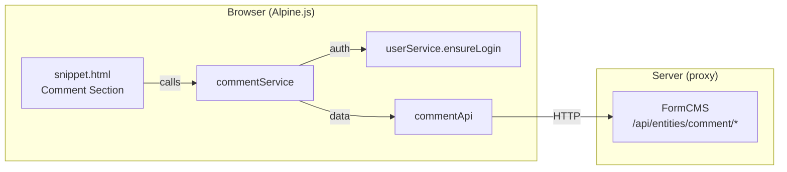

# Comment Section — Alpine.js + MateSdk Component

Add a self-contained comment section to AI-generated pages using the same patterns as the existing engagement bar: an Alpine.js snippet + a `commentService` in the MateSdk + a `commentApi` layer that talks to FormCMS entity APIs.

## Open Questions

> [!IMPORTANT]
> **Entity Schema**: This plan assumes a `comment` entity already exists (or will be created) in FormCMS with fields: `entityName` (string), `recordId` (string), `parentId` (number, nullable), `content` (text), and the built-in `createdBy`/`createdAt`. If this entity doesn't exist yet, you'll need to create it in the admin panel or via the entity designer agent.

> [!IMPORTANT]
> **Nesting depth**: The snippet will support **2 levels** of nesting (top-level comments + replies). This covers the vast majority of comment UIs (Reddit-style deep threading is rare in content sites). Is 2 levels sufficient?

> [!IMPORTANT]
> **Delete policy**: Only the comment author can delete their own comment. There's no admin moderation in this first version.

> [!WARNING]
> **Pagination**: The initial version loads all comments at once (no pagination). For pages with potentially hundreds of comments, we may want to add "Load more" later.

---

## Architecture Overview



This follows the **exact same layered pattern** as the engagement bar:
- `snippet.html` → `service` → `api` → FormCMS backend

---

## Proposed Changes

### 1. Frontend SDK — API Layer

#### [NEW] `packages/mate-service/public/static/api/comment.js`

A thin API layer (same pattern as `engagement.js`) that calls FormCMS entity endpoints:

| Method | Endpoint | Purpose |
|--------|----------|---------|
| `getComments(entityName, recordId)` | `GET /api/entities/comment?entityName=X&recordId=Y&parentId[isNull]=true&sort[id]=-1` | Fetch top-level comments |
| `getReplies(parentId)` | `GET /api/entities/comment?parentId[equals]=X&sort[id]=1` | Fetch replies for a comment |
| `postComment(entityName, recordId, content, parentId)` | `POST /api/entities/comment/insert` | Post a new comment or reply |
| `deleteComment(id)` | `POST /api/entities/comment/delete` | Delete own comment |

---

### 2. Frontend SDK — Service Layer

#### [NEW] `packages/mate-service/public/static/services/comment.js`

Business logic layer (same pattern as `engagment.js`):
- `loadComments(entityName)` — gets `recordId` from `<meta name="record-id">`, fetches top-level comments, then eagerly loads replies for each
- `postComment(entityName, content, parentId?)` — calls `userService.ensureLogin()` first, then inserts the comment and returns updated list
- `deleteComment(entityName, commentId)` — deletes and returns updated list
- Builds a nested structure: each comment gets a `.replies[]` array

---

### 3. Frontend SDK — Export

#### [MODIFY] `packages/mate-service/public/static/index.js`

Add `export * from './services/comment.js';` so the comment service is available as `window.mateSdk.commentService`.

---

### 4. Page Component — Comment Section

#### [NEW] `packages/mate-service/src/agent/page-components/comment-section/`

```
page-components/comment-section/
├── prompt.md      — AI instructions for the comment component
└── snippet.html   — The Alpine.js comment widget
```

**`prompt.md`**: Simple prompt (same pattern as `engagement-bar/prompt.md`) — tells the AI to output the snippet HTML, optionally adapting styling to match the page.

**`snippet.html`**: An Alpine.js component that provides:

- **Comment list**: Renders `comments[]`, each with user name, relative time, content, reply button, delete button (if own)
- **Reply thread**: Nested `<template x-for>` for `comment.replies[]` (1 level deep), indented with `ml-8`
- **Inline reply form**: `x-show="replyingTo === comment.id"` toggles a text input below each comment
- **New comment form**: Textarea + submit button at the top
- **Loading state**: Spinner while fetching
- **Auth-gated**: Post/reply buttons call `commentService.postComment()` which calls `ensureLogin()` automatically

Key Alpine.js data shape:
```js
{
  entityName: '{{entityName}}',
  comments: [],
  newComment: '',
  replyingTo: null,
  replyText: '',
  loading: true,
  currentUser: null,
  async init() { ... },
  async submitComment() { ... },
  async submitReply(parentId) { ... },
  async deleteComment(id) { ... },
  timeAgo(dateStr) { ... }
}
```

---

### 5. Component Registry

#### [MODIFY] `packages/shared/src/constants.ts`

Add `PAGE_COMMENT_SECTION_BUILDER: 'page_comment_section_builder'` to `AGENT_NAMES`.

#### [MODIFY] `packages/mate-service/src/agent/page-components/index.ts`

Register the comment component:
```ts
{
    id: 'comment_section',
    agentName: AGENT_NAMES.PAGE_COMMENT_SECTION_BUILDER,
    label: 'Comment Section',
    icon: 'MessageCircle',
    color: 'pink',
    pageTypes: ['detail'],
    resourceDir: 'comment-section',
    hasSnippet: true,
    chatMessage: 'Add comment section to this page',
}
```

---

## Files Summary

| File | Action | Purpose |
|------|--------|---------|
| `public/static/api/comment.js` | NEW | API calls to FormCMS entity endpoints |
| `public/static/services/comment.js` | NEW | Business logic, auth, data shaping |
| `public/static/index.js` | MODIFY | Export comment service |
| `page-components/comment-section/prompt.md` | NEW | AI prompt for component |
| `page-components/comment-section/snippet.html` | NEW | Alpine.js comment widget |
| `shared/src/constants.ts` | MODIFY | Add agent name |
| `page-components/index.ts` | MODIFY | Register component |

---

## FormCMS Entity Schema

The `comment` entity needs the following fields in FormCMS:

| Field | Type | Notes |
|-------|------|-------|
| `entityName` | string | The entity type this comment belongs to (e.g. `"post"`) |
| `recordId` | string | The ID of the record being commented on |
| `parentId` | number (nullable) | ID of the parent comment for replies; null = top-level |
| `content` | text | The comment body |
| `createdBy` | auto | Built-in FormCMS field (user ID) |
| `createdAt` | auto | Built-in FormCMS field (timestamp) |

---

## Verification Plan

### Manual Verification
1. Navigate to a detail page that has the comment section component
2. Verify comments load (empty state shown if none)
3. Click "Post Comment" → login dialog appears if not logged in
4. Post a comment → appears in the list immediately
5. Reply to a comment → reply appears indented under parent
6. Delete own comment → removed from list
7. Verify another user's comments don't show delete button
