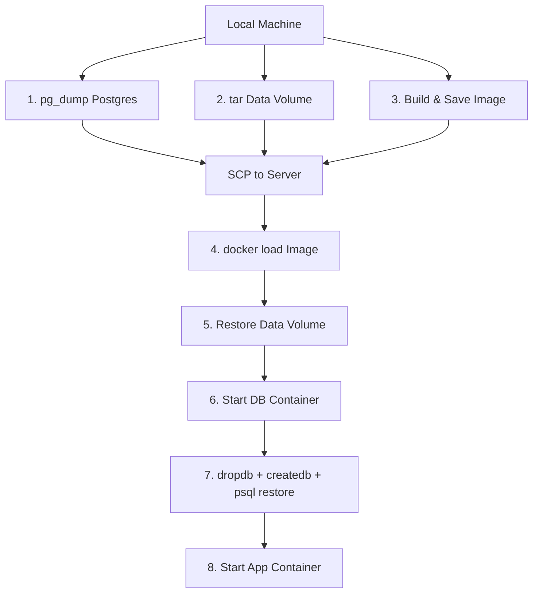

# Deploying Docker Image, Volume & Postgres DB

This document explains how to deploy the application to a remote server, and why Postgres requires special handling compared to simple file-based volumes.

## Overview

A full deployment transfers **three things** to the remote server:

| Artifact | What it contains | How it's transferred |
|---|---|---|
| **Docker Image** (`app_image.tar.gz`) | The application code & runtime | `docker save` → SCP → `docker load` |
| **Data Volume** (`formcms_data.tar.gz`) | SQLite DB, uploaded files, config | `tar` from volume → SCP → `tar` into volume |
| **Postgres Dump** (`cms.sql`) | All Postgres tables & data | `pg_dump` → SCP → `psql` restore |

## Step-by-Step Flow



### 1. Dump Postgres (`pg_dump`)
```bash
docker exec zen-db-1 pg_dump -U postgres cms > cms.sql
```
Produces a portable SQL text file of all tables, data, and schema.

### 2. Archive Data Volume
```bash
docker run --rm -v zen_formcms_data:/volume -v $(pwd)/tmp:/backup \
  alpine tar cvzf /backup/formcms_data.tar.gz -C /volume .
```
This volume contains:
- `mate/sqlite.db` — FormMate's SQLite database
- `files/` — User-uploaded images
- `config/` — Application settings
- `apps/` — Deployed frontend apps (Zen, Hello, etc.)

### 3. Build & Save Image
```bash
./build-fast.sh                                    # Build locally (fast)
docker save formcms-mono-deploy:latest | gzip > app_image.tar.gz
```

### 4. Load Docker Image on Server
```bash
docker load -i app_image.tar.gz
```
`docker load` reads the tar archive and registers it as a local image on the server. After this, `docker images` will show `formcms-mono-deploy:latest`. This is the inverse of `docker save`.

### 5. Restore Data Volume
```bash
# Stop running containers first
docker compose down || true

# Create volume if it doesn't exist
docker volume create zen_formcms_data

# Clear and extract
docker run --rm \
  -v zen_formcms_data:/volume \
  -v $(pwd):/backup \
  alpine sh -c "rm -rf /volume/* && tar xvzf /backup/formcms_data.tar.gz -C /volume"
```

We use a throwaway Alpine container to mount both the Docker volume and the backup directory, then extract the tar into the volume. The `rm -rf /volume/*` ensures a clean slate — no stale files from a previous deployment.

> [!NOTE]
> This volume contains only **file-based data** (SQLite, uploads, config). It's safe to copy raw files because these formats are platform-independent. Postgres data is **not** in this volume.

### 6. Start Database Container
```bash
docker compose up -d db
```
This starts **only** the Postgres container using `docker-compose.yml`. We start it first because we need a running Postgres instance to restore the SQL dump into.

### 7. Wait for Postgres & Restore SQL Dump
```bash
# Wait until Postgres accepts connections
until docker compose exec -T db pg_isready -U postgres; do
    sleep 2
done

# Drop old database, create fresh one, restore dump
docker compose exec -T db dropdb -U postgres --if-exists cms
docker compose exec -T db createdb -U postgres cms
docker compose exec -T db psql -U postgres cms < cms.sql
```

**Why `dropdb` + `createdb`?** The `pg_dump` output assumes a clean database. If tables already exist, the restore would fail with "relation already exists" errors. Dropping and recreating guarantees a clean target.

**Why `-T` flag?** When running `docker compose exec` inside an SSH heredoc (`ssh host << EOF`), Docker tries to allocate a pseudo-TTY connected to stdin. The `-T` flag disables this, preventing Docker from consuming the rest of the SSH heredoc as stdin input — which would silently skip all remaining commands.

### 8. Start Application Container
```bash
docker compose up -d app
```
Now that the database is restored and the data volume is in place, we start the application container. It connects to the already-running Postgres container and mounts the restored `formcms_data` volume.

---

## Why Can't We Simply Copy the Postgres Volume?

Postgres stores data in a **binary format** inside its volume (`/var/lib/postgresql/data`). Unlike SQLite (a single `.db` file), this binary data has strict requirements:

### 1. Platform-Dependent Binary Format
Postgres data files are tied to the **CPU architecture, OS, and Postgres version**. Copying raw files between different environments (e.g., Mac Docker VM → Linux server) can cause:
- Byte-ordering mismatches
- Shared memory configuration conflicts
- WAL (Write-Ahead Log) corruption

### 2. Running Process = Corrupt Copy
If Postgres is running when you copy the volume, the data files may be in an **inconsistent state** (partially written transactions, dirty buffers). This leads to corruption on restore. You would need to:
1. Stop the Postgres container
2. Copy the volume
3. Restart the container

This adds downtime and complexity.

### 3. `pg_dump` is the Safe Alternative
`pg_dump` produces a **logical, portable SQL dump** that works across:
- Different operating systems
- Different CPU architectures
- Different Postgres minor versions
- Running databases (no downtime needed)

The restore process (`dropdb` → `createdb` → `psql < dump.sql`) guarantees a clean, consistent database state.

### Summary

| Approach | Portable? | Safe while running? | Cross-platform? |
|---|---|---|---|
| Copy `postgres_data` volume | ❌ | ❌ | ❌ |
| `pg_dump` / `psql` restore | ✅ | ✅ | ✅ |

> [!IMPORTANT]
> Always use `pg_dump` for Postgres. Only copy volumes directly for **file-based storage** like SQLite, uploads, and config files.

---

## Reference

- [docker-compose.yml](file:///Users/jingshunchen/repos/formcms-repos/formmate/mono-deploy/docker-compose.yml) — Service definitions
- [build-fast.sh](file:///Users/jingshunchen/repos/formcms-repos/formmate/mono-deploy/build-fast.sh) — Local build script
