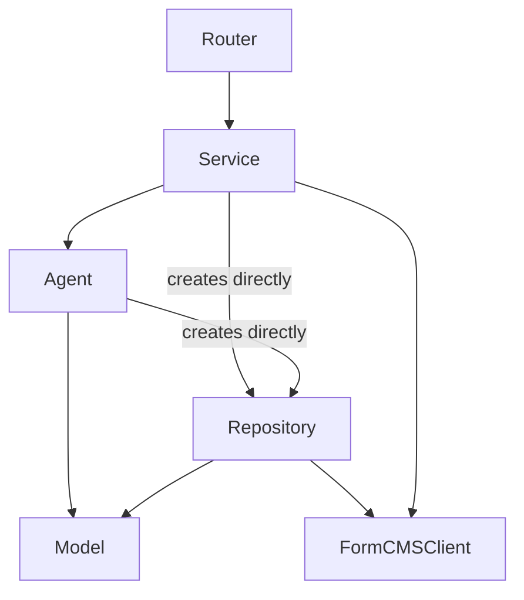
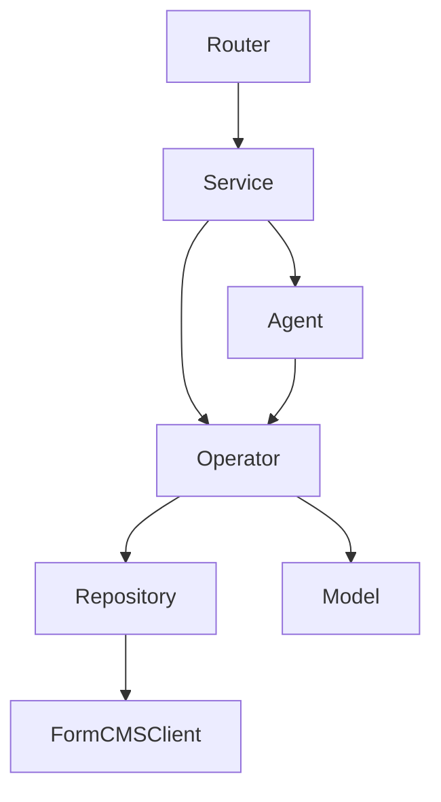

# Mate Service Architecture Analysis

## Current State

The mate-service has 5 layers with these actual responsibilities today:

| Layer | Intended Role | Actual Role |
|---|---|---|
| **DTO** | Shared types between FE/BE | ✅ Working as intended (in `@formmate/shared`) |
| **Service** | Thin orchestrator of agents | ⚠️ `ChatService` contains business logic (e.g., `handleSystemPlanResponse` iterates items, builds prompts, dispatches agents) |
| **Agent** | Think/Act pipeline | ⚠️ Agents directly instantiate repositories and have heavy persistence logic |
| **Repository** | Data access | ⚠️ `PageRepository` and `EntityRepository` contain orchestration/business logic |
| **Model** | Business logic | ⚠️ Pure data transformers only — no access to repositories |

### Dependency Graph Today



## Core Problems

### 1. Repositories are too fat
`PageRepository` has methods like `saveLayout` that fetch existing schema, parse metadata JSON, compile HTML, construct payload, and save — business orchestration disguised as data access.

`EntityRepository.commit` iterates entities, applies relationships through models, and saves — that's workflow logic, not persistence.

### 2. Models can't do much
Models (`EntityModel`, `RelationshipModel`, `AttributeModel`) are good at normalization/transformation, but they're stateless value objects with no access to repositories.

### 3. Agents do too much persistence work
Agents like `EntityGenerator.act` directly use `formCMSClient` to fetch/compare schemas. `PageBuilder` creates `PageRepository` inside `think()`.

---

## Recommendation: Introduce an Operator Layer

An **Operator** layer sits between Service/Agent and Repository, owning business workflows that currently leak into both.

> **Why "Operator"?** It's specific enough to avoid becoming a god-object dumping ground (the "Manager" anti-pattern). Alternatives considered: `UseCase` (Clean Architecture), `Coordinator`, `DomainService`. Pick whichever resonates — the key is the *layer*, not the name.

### Proposed Architecture



### Role of Each Layer (Revised)

| Layer | Responsibility | Can Call |
|---|---|---|
| **Service** | HTTP/Socket coordination, context creation, message save/emit | Agent, Operator |
| **Agent** | AI interaction (think/act), prompt construction | Operator (for persistence + business logic) |
| **Operator** | Business workflows, orchestrates Model + Repository | Repository, Model |
| **Repository** | Pure CRUD against FormCMS API / Prisma | FormCMSClient, Prisma |
| **Model** | Data transformation, validation, normalization | Nothing (pure functions) |

### Concrete Operator Examples

#### `EntityOperator`
Absorbs business logic from `EntityRepository.commit` and `EntityGenerator.act`:

```typescript
class EntityOperator {
  constructor(
    private readonly formCMSClient: FormCMSClient,
    private readonly logger: ServiceLogger
  ) {}

  // From EntityGenerator.act — compare with existing, prepare summary
  async prepareSummary(entities: EntityDto[], externalCookie: string): Promise<SchemaSummary> { ... }

  // From EntityRepository.commit — orchestrate save with relationships
  async commit(summary: SchemaSummary, externalCookie: string): Promise<string[]> { ... }
}
```

#### `PageOperator`
Absorbs the read-modify-write orchestration from `PageRepository`:

```typescript
class PageOperator {
  constructor(
    private readonly formCMSClient: FormCMSClient,
    private readonly logger: ServiceLogger
  ) {}

  async saveArchitecture(schemaId: string, architecture: any, cookie: string): Promise<void> { ... }
  async saveComponents(schemaId: string, layout: LayoutJson, components: Record<string, ...>, cookie: string): Promise<string> { ... }
}
```

#### `AgentTaskOperator`

```typescript
class AgentTaskOperator {
  constructor(
    private readonly taskRepository: IAgentTaskRepository,
    private readonly agentTaskModel: AgentTaskModel
  ) {}

  async createFromRequirement(requirement: SystemRequirement): Promise<AgentTask> {
    const task = this.agentTaskModel.parse(requirement);
    return this.taskRepository.save(task);
  }
}
```

### What Changes in Existing Layers

| Current | After |
|---|---|
| `PageRepository` | Thin — just `saveSchema`, `getSchema`, `getAllPages` |
| `EntityRepository` | Thin — just `saveEntity`, `getEntity`, `getAllEntities` |
| `EntityGenerator.act` | Calls `entityOperator.prepareSummary()` |
| `PageBuilder.think` | Calls `pageOperator` instead of creating `PageRepository` |
| `ChatService.handleSystemPlanResponse` | Calls `agentTaskOperator.createFromRequirement()` |

### Models Should Stay Pure

Models should not call repositories. The Operator layer gives the same convenience: it calls models for transformation AND repositories for persistence in the same method — without making models impure or harder to test.

---

## Migration Strategy

Introduce operators incrementally:

1. **Start with `EntityOperator`** — clearest case. Extract `EntityRepository.commit` and schema comparison from `EntityGenerator.act`.
2. **Then `PageOperator`** — extract read-modify-write workflows from `PageRepository`.
3. **Thin out repositories** — they become simple CRUD wrappers.
4. **Update agents** — inject operators instead of creating repositories directly.

Each step is independently shippable.
