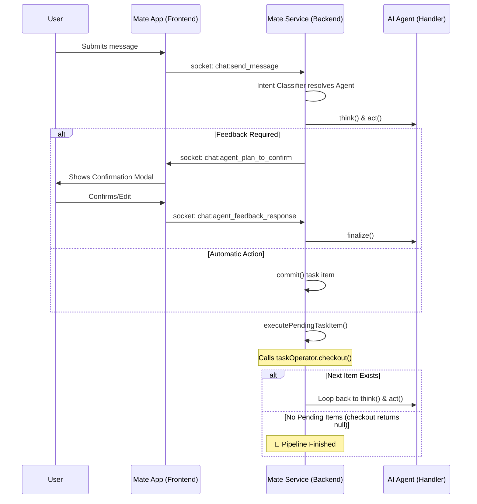

# Mate Service to App End-to-End Flow Plan

This plan documents the communication pipeline between the `mate-service` backend and the `mate-app` frontend, clarifies the task completion logic, and outlines UI/UX improvements.

## End-to-End Pipeline Overview

The sequence below describes how a user message triggers an AI agent and how the pipeline continues or pauses for feedback.

## Task Completion Logic

The `mate-service` uses a recursive pipeline anchored by `executePendingTaskItem`.

- **Checkout Sentinel**: When `taskOperator.checkout(taskId)` is called, it searches for the first `pending` item in the database.
- **Completion Signal**: If `checkout` returns **null**, it means all items in the current task are marked `finished`. The service stops execution, effectively ending the agent's work for that specific prompt.

## UI Display & UX Recommendations

To make the "Mate App" look premium and provide better feedback, here are some key areas for improvement:

| Area | Current State | Improvement Opportunity |
| :--- | :--- | :--- |
| **Message bubbles** | Basic rounded, user right / agent left | Add avatar icons, subtle gradient for agent bubble |
| **Task progress** | Not shown in chat | Show a task progress bar or inline step indicator |
| **Agent status bar** | `StatusBar` component shows agent name | Could show step `N of M` when a multi-step task runs |
| **Confirmation modals** | Full-modal dialogs | Consider inline confirmation cards in the chat itself |
| **Code blocks in markdown** | Basic pre/code styling | Add syntax highlighting (e.g. `react-syntax-highlighter`) |

### Specific Recommendations:
- **Inline Task Progress**: Instead of a global status bar, show a stepper or progress indicator inside the chat bubble (e.g., "Step 2 of 4: Generating Schema...").
- **Improved Message Bubbles**:
    - Use subtle gradients for agent messages.
    - Add avatar icons for different agents (e.g., a "drafting" icon for Entity Designer).
- **Code Highlighting**: Add `react-syntax-highlighter` to the `MessageBubble` component to support syntax highlighting for specific languages (SQL, TypeScript, etc.).

## Markdown Support & Fixes

The app already supports Markdown via `react-markdown` and `remark-gfm`. 

> [!TIP]
> **CSS Fix Required**: The `index.css` file currently references `var(--app-muted)` in some places but defines `--bg-muted`. Standardizing these variables will ensure consistent styling for code blocks.

### Current Markdown Capabilities:
- ✅ GFM Tables & Lists
- ✅ Blockquotes & Headings
- ✅ Bold/Italic formatting
- ✅ Copy-to-clipboard button
