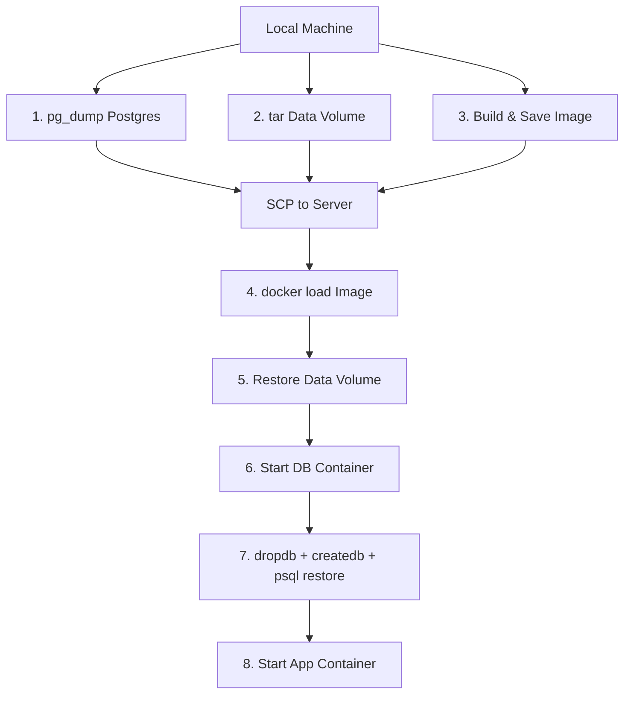

# Data Migration & Deployment Guide

This guide explains how to migrate your data from a local Docker environment to a remote server and how to deploy the application. This process involves backing up your data from local Docker volumes, transferring the backup files to your server, and restoring them.

## Overview

A full deployment transfers **three things** to the remote server:

| Artifact | What it contains | How it's transferred |
|---|---|---|
| **Docker Image** (`app_image.tar.gz`) | The application code & runtime | `docker save` → SCP → `docker load` |
| **Data Volume** (`formcms_data.tar.gz`) | SQLite DB, uploaded files, config | `tar` from volume → SCP → `tar` into volume |
| **Postgres Dump** (`cms.sql`) | All Postgres tables & data | `pg_dump` → SCP → `psql` restore |

## Prerequisites

- Local machine with Docker installed and running.
- Remote server with Docker installed and running.
- SSH access to the remote server.
- `rsync` or `scp` for file transfer.

## Step-by-Step Flow



### 1. Dump Postgres (`pg_dump`)
```bash
docker exec zen-db-1 pg_dump -U postgres cms > cms.sql
```
Produces a portable SQL text file of all tables, data, and schema.

### 2. Archive Data Volume
```bash
docker run --rm -v zen_formcms_data:/volume -v $(pwd)/tmp:/backup \
  alpine tar cvzf /backup/formcms_data.tar.gz -C /volume .
```
This volume contains:
- `mate/sqlite.db` — FormMate's SQLite database
- `files/` — User-uploaded images
- `config/` — Application settings
- `apps/` — Deployed frontend apps (Zen, Hello, etc.)

### 3. Build & Save Image
```bash
./build-fast.sh                                    # Build locally (fast)
docker save formcms-mono-deploy:latest | gzip > app_image.tar.gz
```

### 4. Load Docker Image on Server
```bash
docker load -i app_image.tar.gz
```
`docker load` reads the tar archive and registers it as a local image on the server. After this, `docker images` will show `formcms-mono-deploy:latest`.

### 5. Restore Data Volume
```bash
# Stop running containers first
docker compose down || true

# Create volume if it doesn't exist
docker volume create zen_formcms_data

# Clear and extract
docker run --rm \
  -v zen_formcms_data:/volume \
  -v $(pwd):/backup \
  alpine sh -c "rm -rf /volume/* && tar xvzf /backup/formcms_data.tar.gz -C /volume"
```

We use a throwaway Alpine container to mount both the Docker volume and the backup directory, then extract the tar into the volume. The `rm -rf /volume/*` ensures a clean slate.

> [!NOTE]
> This volume contains only **file-based data** (SQLite, uploads, config). It's safe to copy raw files because these formats are platform-independent. Postgres data is **not** in this volume.

### 6. Start Database Container
```bash
docker compose up -d db
```
This starts **only** the Postgres container first because we need it running to restore the SQL dump.

### 7. Wait for Postgres & Restore SQL Dump
```bash
# Wait until Postgres accepts connections
until docker compose exec -T db pg_isready -U postgres; do
    sleep 2
done

# Drop old database, create fresh one, restore dump
docker compose exec -T db dropdb -U postgres --if-exists cms
docker compose exec -T db createdb -U postgres cms
docker compose exec -T db psql -U postgres cms < cms.sql
```

**Why `dropdb` + `createdb`?** The `pg_dump` output assumes a clean database. Dropping and recreating guarantees a clean target.

**Why `-T` flag?** Disables pseudo-TTY allocation, which is necessary when running inside an SSH heredoc to prevent consuming the rest of the script as stdin.

### 8. Start Application Container
```bash
docker compose up -d app
```
Now that the database is restored and the data volume is in place, start the app container.

---

## Why Can't We Simply Copy the Postgres Volume?

Postgres stores data in a **binary format** inside its volume (`/var/lib/postgresql/data`). This leads to several issues:

1. **Platform-Dependent Binary Format**: Tied to CPU architecture, OS, and version. Copying between Mac Docker VM and a Linux server often causes corruption.
2. **Consistency**: Copying a volume from a running database can result in partially written transactions.
3. **The Safe Alternative**: `pg_dump` produces a **logical, portable SQL dump** that is consistent and works across platforms.

---

## The "Bundle" Strategy (Dumping Image & Volume Together)

Docker treats **Images** and **Volumes** as separate entities. While there is no single native command to dump both, you can script a bundled backup:

1.  **Save the Image**: Use `docker save`.
2.  **Archive the Volume**: Use `tar` in a temporary container.
3.  **Combine**: Zip them into a single archive.

### Manual Bundle Example
```bash
# 1. Save Image
docker save -o my-image.tar formcms-mono-deploy:latest

# 2. Backup Volume
docker run --rm -v zen_formcms_data:/volume -v $(pwd):/backup alpine tar cvf /backup/my-volume.tar /volume

# 3. Archive Both
tar cvzf full-backup.tar.gz my-image.tar my-volume.tar
```

---

## Troubleshooting

- **Permission Denied**: Ensure the user running the restore command has write permissions in the target directory inside the container.
- **Version Mismatch**: Ensure the PostgreSQL version on the server matches or is newer than the local version.
- **SSH Heredoc Issues**: Ensure the `-T` flag is used with `docker compose exec` if restoring over SSH scripts.

## Reference

- [docker-compose.yml](../mono-deploy/docker-compose.yml) — Service definitions
- [build-fast.sh](../mono-deploy/build-fast.sh) — Local build script
