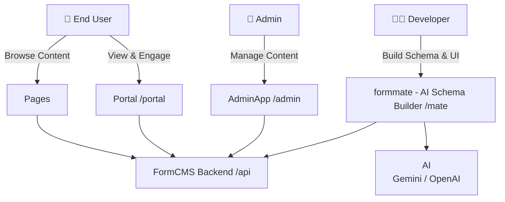

# Architecture

## High-Level Overview

## 1. formmate (AI Schema & UI Builder)

The "brain" of the ecosystem. This tool leverages LLMs to architect your data models and design your UI. It translates your natural language requirements into technical configurations that the system understands.

### Key Capabilities:
- **Schema Generation**: Describe your domain in natural language, get normalized database schemas
- **Data Seeding**: Generate realistic sample data with relational integrity
- **Query Building**: Create GraphQL queries from prompts, auto-convert to REST endpoints
- **UI Generation**: Generate HTML/CSS pages connected to your data
- **Engagement Features**: Add likes, shares, views, toplist, page tracking, and user avatars via prompts
- **Version History**: Access and rollback all generated content in the portal

---

## 2. formcms (Backend Engine)

The core high-performance engine built with **ASP.NET Core (C#)**.

### Features:
- **REST & GraphQL**: Automatically exposes APIs for every entity you define
- **Normalized Storage**: Optimized for speed (Sqlite, Postgres, SQL Server, MySQL supported)
- **User Engagement**: Built-in likes, bookmarks, shares, views, toplist, and page tracking with buffered writes
- **Social Features**: Notifications, comments system, and popularity scoring
- **Scale**: Designed to handle millions of records and high-concurrency environments

### Performance Stats:
- P95 latency under 200ms for the slowest APIs
- Throughput over 2,400 QPS per application node
- Support for complex queries (5-table joins over 1M rows)
- Efficient handling of large tables (100M+ records for user activities)

### Database Support:
| Database | Status |
|----------|--------|
| SQLite | ✅ Full Support |
| PostgreSQL | ✅ Full Support |
| SQL Server | ✅ Full Support |
| MySQL | ✅ Full Support |

---

## 3. FormCmsAdminApp (Management Dashboard)

A sleek, **React-based** administrative interface.

### Features:
- Manage your content data (CRUD operations)
- Edit related content inline
- Manage assets (images, files) with local or cloud storage
- Built-in audit logging and publication workflows

---

## 4. Pages (Frontend)

Server-side rendered pages for end users to browse content.

### How It Works:
1. **Template Storage**: Handlebars templates are saved to FormCMS database
2. **Server Rendering**: FormCMS backend reads the template, executes the page's query definition to load data, and renders HTML
3. **Dynamic Hydration**: After the page loads in the browser, Alpine.js fetches and displays dynamic social data (likes, views, etc.)

### Features:
- **SEO Optimized**: Server-rendered HTML for search engine visibility
- **Handlebars Templating**: Flexible server-side rendering with Handlebars
- **Built-in Routing**: Automatic routes based on page configuration
- **Cached for Performance**: Response caching for fast page loads
- **Social Features**: Built-in likes, shares, views, and toplist

---

## 5. FormCmsPortal (User Portal)

A personalized portal where users can manage their social engagement and content.

### Features:
- **History**: View previously accessed content
- **Liked Items**: Browse and manage liked content
- **Bookmarked Items**: Organize saved content with folders
