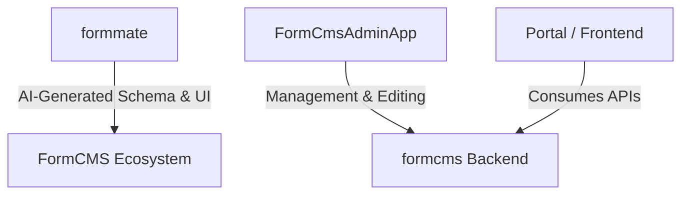

# Architecture

FormCMS is built on a modern, decoupled architecture designed for performance and flexibility.

## Overview of the Components

| Repos             | Overview                                                                | 
| ----------------- | ----------------------------------------------------------------------- | 
| Formmatte         | schema + UI builder that produces JSON schema/config  AI                | 
| formcms (backend) | CMS backend with entities, GraphQL/REST, assets, and engagement features | 
| FormCmsAdminSdk   | React SDK that talks to the backend, handles admin state and APIs       |
| FormCmsAdminApp   | React admin panel for managing content data                             | 
| FormCmsPortal     | User portal for view history, liked items, and bookmarked content       | 

---

## 1. formmate (AI Schema & UI Builder)

The "brain" of the ecosystem. This tool leverages LLMs to architect your data models and design your UI. It translates your natural language requirements into technical configurations that the system understands.

### Key Capabilities:
- **Schema Generation**: Describe your domain in natural language, get normalized database schemas
- **Data Seeding**: Generate realistic sample data with relational integrity
- **Query Building**: Create GraphQL queries from prompts, auto-convert to REST endpoints
- **UI Generation**: Generate HTML/CSS pages connected to your data
- **Engagement Features**: Add likes, shares, views, and user avatars via prompts
- **Version History**: Access and rollback all generated content in the portal

---

## 2. formcms (Backend Engine)

The core high-performance engine built with **ASP.NET Core (C#)**.

### Features:
- **REST & GraphQL**: Automatically exposes APIs for every entity you define
- **Normalized Storage**: Optimized for speed (Sqlite, Postgres, SQL Server, MySQL supported)
- **User Engagement**: Built-in likes, bookmarks, shares, views tracking with buffered writes
- **Social Features**: Notifications, comments system, and popularity scoring
- **Scale**: Designed to handle millions of records and high-concurrency environments

### Performance Stats:
- P95 latency under 200ms for the slowest APIs
- Throughput over 2,400 QPS per application node
- Support for complex queries (5-table joins over 1M rows)
- Efficient handling of large tables (100M+ records for user activities)

### Database Support:
| Database | Status |
|----------|--------|
| SQLite | ✅ Full Support |
| PostgreSQL | ✅ Full Support |
| SQL Server | ✅ Full Support |
| MySQL | ✅ Full Support |

---

## 3. FormCmsAdminApp (Management Dashboard)

A sleek, **React-based** administrative interface.

### Features:
- Manage your content data (CRUD operations)
- Visual editors for relationships and related data
- Built-in audit logging and publication workflows

---

## 4. FormCmsAdminSdk

React SDK that talks to the backend, handles admin state and APIs.

### What it provides:
- Pre-built React hooks for CMS operations
- State management for admin workflows
- API client with authentication handling
- Type-safe interfaces for all CMS entities

---

## 5. FormCmsPortal (User Portal)

A personalized portal where users can manage their social engagement and content.

### Features:

#### History
Users can view a list of all items they have previously accessed (pages, posts, or other content). Each item is displayed with a clickable link for easy revisiting.

#### Liked Items
Displays all posts or content the user has liked. Users can browse, unlike content, or click through to view full items.

#### Bookmarked Items
Users can organize saved content with custom folders for easy categorization. Manage and access bookmarks by folder or as a complete list.
