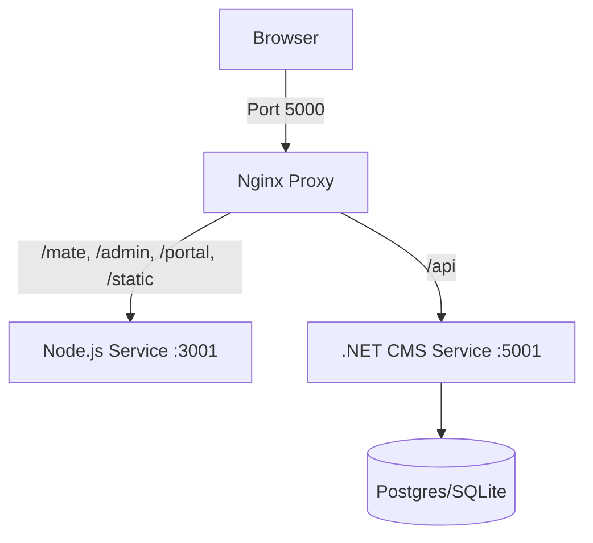

# FormCMS Docker Deployment Guide

This guide explains how to deploy FormCMS using Docker Compose. The setup includes both the Frontend/Backend (Node.js) and the Headless CMS (.NET) in a **single container** (`app`), orchestrated alongside a Database container (`db`).

---

## 🏗 Architecture

The `formcms-mono-deploy` image consolidates multiple services:
1.  **Nginx (Port 5000)**: Used as the gateway. Proxies requests to internal services.
    *   `/mate/*`, `/admin/*`, `/portal/*`, `/static/*` → Node.js (Port 3001)
    *   `/api/*` → .NET CMS (Port 5001)
2.  **Node.js Backend**: Runs the AI Schema Builder (`formmate`) which makes schema generation easy, and serves the frontend SPA.
3.  **ASP.NET Core CMS**: Runs the core CMS logic and API.

### Service Map


---

## 🚀 Quick Start

### 1. Build the Image
We provide a fast build script that compiles artifacts locally and copies them into the image.

```bash
cd formmate/mono-deploy
./build-fast.sh
```

### 2. Run the Container
Use `reload.sh` to restart the containers with the latest image.

```bash
./reload.sh
```
This script handles stopping, removing, and recreating the `app` container while preserving the `db` volume.

---

## ⚙️ Configuration & Persistence

FormCMS configuration (database connection) differs from standard environment variables because it supports **runtime updates**.

### Initial Setup (First Run)
When the container starts for the **first time**, `entrypoint.sh` generates a default configuration file (`/app/formcms/formcms.settings.json`) using these environment variables from `docker-compose.yml`:

| Variable | Default | Description |
|----------|---------|-------------|
| `DATABASE_PROVIDER` | `1` (Postgres) | 0=SQLite, 1=Postgres, 2=SqlServer, 3=MySQL |
| `CONNECTION_STRING` | `Host=db...` | ADO.NET connection string |


### Persistence Logic
*   **Settings File**: `formcms.settings.json` is stored inside the container.
    *   ✅ **Persists** on `docker restart` (container stopped/started).
    *   ❌ **Lost** on `docker-compose down` or recreation (unless mapped to a volume).
    *   **Safeguard**: `entrypoint.sh` checks if the file exists. If found, it **skips generation**, preserving your changes.
*   **Database Data**:
    *   Postgres data is persisted in the `postgres_data` volume.
    *   SQLite data is persisted in the `sqlite_data` volume.

> **Tip**: Since `formcms.settings.json` is preserved on restart, you only need to set `CONNECTION_STRING` correctly for the initial run. If you need to change database settings later, verify the file inside the container or use the UI.

---

## 🛠 Troubleshooting

### "System Not Ready" / Database Connection Failed
If the database container is down or unreachable:
77: 1.  The app will **NOT crash**. It enters a fallback "Setup Mode".
78: 2.  You can access the System Settings page (`/mate/settings`).
79: 3.  Unlock the "Database" tab.
4.  Update the connection string and click Save.
5.  The app will restart internally to apply changes.

### Resetting Configuration
If you need to reset the configuration to defaults:
1.  **Option A (Reset Config)**:
    *   `docker-compose exec app rm /config/formcms.settings.json`
    *   Restart the container (`docker-compose restart app`).
    *   This forces `entrypoint.sh` to regenerate the default configuration.
2.  **Option B (Sed)**:
    *   Run this command to reset the connection string to null:
    *   `docker-compose exec app sed -i 's/"ConnectionString"[[:space:]]*:[[:space:]]*[^,}]\+/"ConnectionString": null/' /config/formcms.settings.json`
    *   Restart the container.

### 502 Bad Gateway
*   **Cause**: The .NET backend is restarting or failed to start.
*   **Wait**: Give it 5-10 seconds. Nginx returns a custom 503 "The system is restarting status" page during startup.
*   **Check Logs**: `docker-compose logs app` to see .NET exceptions.

### Viewing Nginx Logs
Nginx access logs are stored inside the container at `/var/log/nginx/access.log`. To view them in real-time:

```bash
docker-compose exec app tail -f /var/log/nginx/access.log
```

---

## 📂 Volume Management

| Volume | Mount Path | Purpose |
|--------|------------|---------|
| `postgres_data` | `/var/lib/postgresql/data` | Persists Postgres DB data |
| `sqlite_data` | `/app/packages/mate-service/data` | Persists SQLite DB file |
| `formcms_config` | `/config` | Persists FormCMS settings |

To reset everything (Clean Slate):
```bash
docker-compose down -v
```
**Warning**: This deletes all database data!
