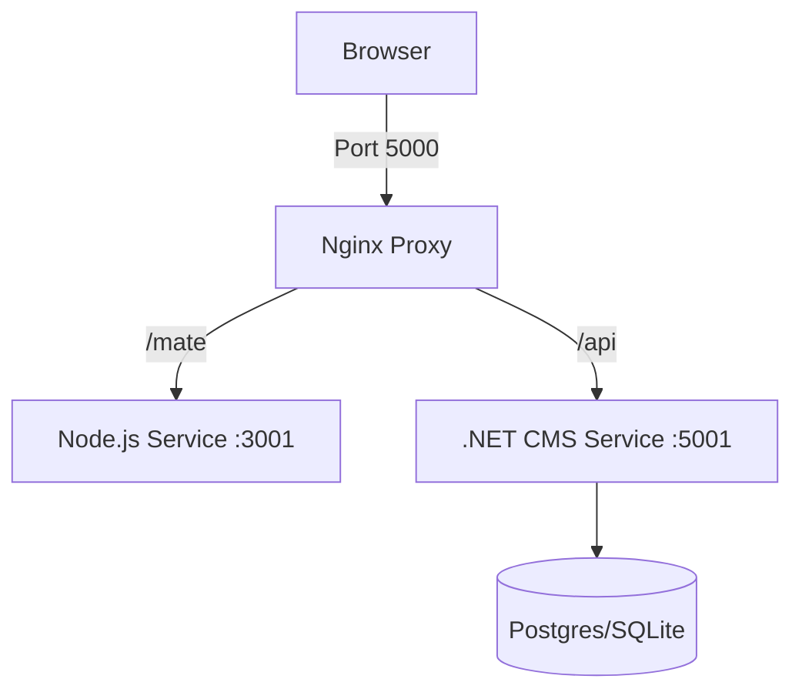

# FormCMS Docker Deployment Guide

This guide explains how to deploy FormCMS using Docker Compose. The setup includes both the Frontend/Backend (Node.js) and the Headless CMS (.NET) in a **single container** (`app`), orchestrated alongside a Database container (`db`).

---

## 🏗 Architecture

The `formcms-mono-deploy` image consolidates multiple services:
1.  **Nginx (Port 5000)**: Used as the gateway. Proxies requests to internal services.
    *   `/mate/*` → Node.js (Port 3001)
    *   `/api/*` → .NET CMS (Port 5001)
2.  **Node.js Backend**: Runs the `formmate` orchestrator and serves the frontend SPA.
3.  **ASP.NET Core CMS**: Runs the core CMS logic and API.

### Service Map


---

## 🚀 Quick Start

### 1. Build the Image
We provide a fast build script that compiles artifacts locally and copies them into the image.

```bash
cd formmate/mono-deploy
./build-fast.sh
```

### 2. Run the Container
Use `reload.sh` to restart the containers with the latest image.

```bash
./reload.sh
```
This script handles stopping, removing, and recreating the `app` container while preserving the `db` volume.

---

## ⚙️ Configuration & Persistence

FormCMS configuration (database connection, master password) differs from standard environment variables because it supports **runtime updates**.

### Initial Setup (First Run)
When the container starts for the **first time**, `entrypoint.sh` generates a default configuration file (`/app/formcms/formcms.settings.json`) using these environment variables from `docker-compose.yml`:

| Variable | Default | Description |
|----------|---------|-------------|
| `DATABASE_PROVIDER` | `1` (Postgres) | 0=SQLite, 1=Postgres, 2=SqlServer, 3=MySQL |
| `CONNECTION_STRING` | `Host=db...` | ADO.NET connection string |
| `MASTER_PASSWORD` | `""` (Empty) | Initial master password |

### Persistence Logic
*   **Settings File**: `formcms.settings.json` is stored inside the container.
    *   ✅ **Persists** on `docker restart` (container stopped/started).
    *   ❌ **Lost** on `docker-compose down` or recreation (unless mapped to a volume).
    *   **Safeguard**: `entrypoint.sh` checks if the file exists. If found, it **skips generation**, preserving your changes (e.g., set Master Password).
*   **Database Data**:
    *   Postgres data is persisted in the `postgres_data` volume.
    *   SQLite data is persisted in the `sqlite_data` volume.

> **Tip**: If you recreation the container (e.g., deployment update), ensuring `MASTER_PASSWORD` in `docker-compose.yml` matches your current password can help re-initialize correctly, though manual re-entry in UI might be needed if the settings file is lost.

---

## 🛠 Troubleshooting

### "System Not Ready" / Database Connection Failed
If the database container is down or unreachable:
1.  The app will **NOT crash**. It enters a fallback "Setup Mode".
2.  You can access the System Settings page (`/mate/settings`).
3.  Unlock the "Database" tab using your **Master Password**.
4.  Update the connection string and click Save.
5.  The app will restart internally to apply changes.

### Resetting Master Password
If you lose your master password and cannot access settings:
1.  **Option A (Destructive)**:
    *   Stop validation.
    *   Delete the container (`docker-compose rm -f app`).
    *   This clears `formcms.settings.json`.
    *   Start again; Master Password will be reset to empty (or env var value).
2.  **Option B (Manual Edit)**:
    *   `docker-compose exec app sh`
    *   Edit `/app/formcms/formcms.settings.json` manually (it's a JSON file).
    *   Restart the container.

### 502 Bad Gateway
*   **Cause**: The .NET backend is restarting or failed to start.
*   **Wait**: Give it 5-10 seconds. Nginx returns a custom 503 "The system is restarting status" page during startup.
*   **Check Logs**: `docker-compose logs app` to see .NET exceptions.

---

## 📂 Volume Management

| Volume | Mount Path | Purpose |
|--------|------------|---------|
| `postgres_data` | `/var/lib/postgresql/data` | Persists Postgres DB data |
| `sqlite_data` | `/app/packages/backend/data` | Persists SQLite DB file |

To reset everything (Clean Slate):
```bash
docker-compose down -v
```
**Warning**: This deletes all database data!
