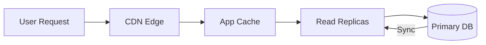
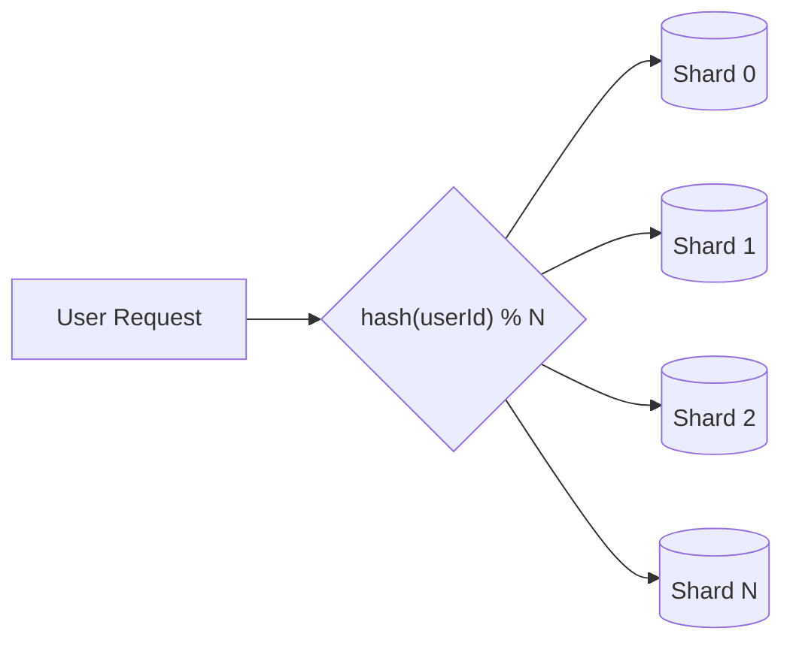

# Performance & Scalability

FormCMS is designed for speed and scale, rivaling specialized GraphQL engines while providing full CMS functionality.

## Key Performance Metrics

| Metric | Performance |
|--------|-------------|
| **P95 Latency** | < 200ms (slowest APIs) |
| **Throughput** | 2,400+ QPS per node |
| **Complex Queries** | 5-table joins over 1M rows |
| **Activity Data** | 100M+ records supported |

---

## How We Achieve This

### Real Database Fields (Not Key-Value)

**Traditional CMS** stores custom fields as key-value pairs:
```
| record_id | field_name | field_value |
|-----------|------------|-------------|
| 1         | title      | "Hello"     |
| 1         | price      | "29.99"     |
```
This is flexible but **slow** – you can't build indexes on arbitrary key-value data.

**FormCMS** creates actual database columns for each field:
```
| id | title   | price |
|----|---------|-------|
| 1  | "Hello" | 29.99 |
```
This allows you to build **indexes** and **compound indexes** on any field, enabling:
- Fast lookups by any column
- Efficient filtering and sorting
- Complex JOINs across related tables

### Smart Caching

FormCMS uses a multi-layer caching strategy to minimize database hits (see [diagram below](#cms-content-cache--replicate)):

| Layer | What's Cached | Benefit |
|-------|--------------|---------|
| **CDN Edge** | Rendered pages, API responses | Users get data from nearest server |
| **App Memory** | Schema definitions, frequent queries | No network call needed |
| **Redis** | Shared cache for multi-server setups | All servers see the same cached data |

Most requests never reach the database.

### Write Buffering
High-volume user activities (likes, views, shares) are buffered in memory and batch-flushed every minute—achieving 19ms P95 at 4,200 QPS.

---

## Scaling Strategy

FormCMS uses **different strategies** for different types of data:

### CMS Content: Cache & Replicate

Content data (articles, products, courses) changes infrequently. Scale with caching and read replicas:



### User Activity: Shard

Activity data (likes, views, bookmarks) is high-volume. Scale by sharding based on user ID:



Each shard handles a portion of users. Add more shards as you grow.

### Summary

| Data Type | Strategy | Why |
|-----------|----------|-----|
| **CMS Content** | Cache + Replicate | Read-heavy, rarely changes |
| **User Activity** | Shard by userId | Write-heavy, per-user isolation |

---

## Real-World Scale

FormCMS architecture supports:
- **News Portals**: Millions of articles with CDN caching
- **Online Courses**: Complex hierarchies with efficient queries
- **Video Platforms**: HLS video + billions of view tracking
- **Social Platforms**: User-generated content with engagement features
